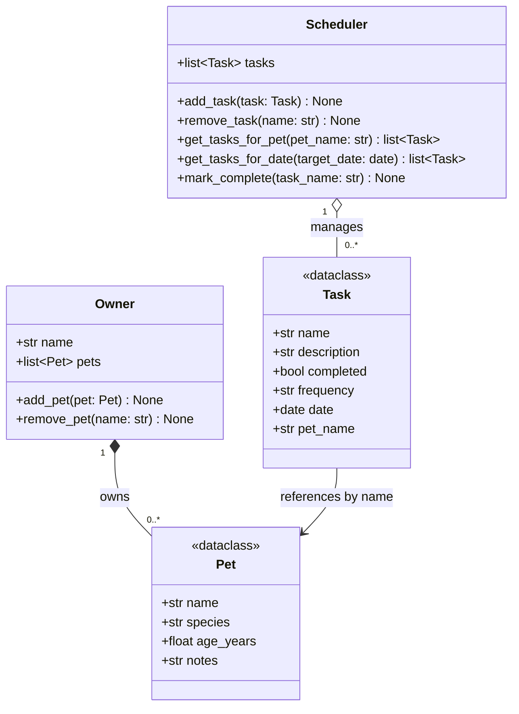

# PawPal+ UML Class Diagram

```mermaid
classDiagram

    class Task {
        <<dataclass>>
        +str name
        +str description
        +bool completed
        +str frequency
        +date date
        +str pet_name
    }

    class Pet {
        <<dataclass>>
        +str name
        +str species
        +float age_years
        +str notes
    }

    class Owner {
        +str name
        +list~Pet~ pets
        +add_pet(pet: Pet) None
        +remove_pet(name: str) None
    }

    class Scheduler {
        +list~Task~ tasks
        +add_task(task: Task) None
        +remove_task(name: str) None
        +get_tasks_for_pet(pet_name: str) list~Task~
        +get_tasks_for_date(target_date: date) list~Task~
        +mark_complete(task_name: str) None
    }

    Owner "1" *-- "0..*" Pet : owns
    Scheduler "1" o-- "0..*" Task : manages
    Task --> Pet : references by name
```
