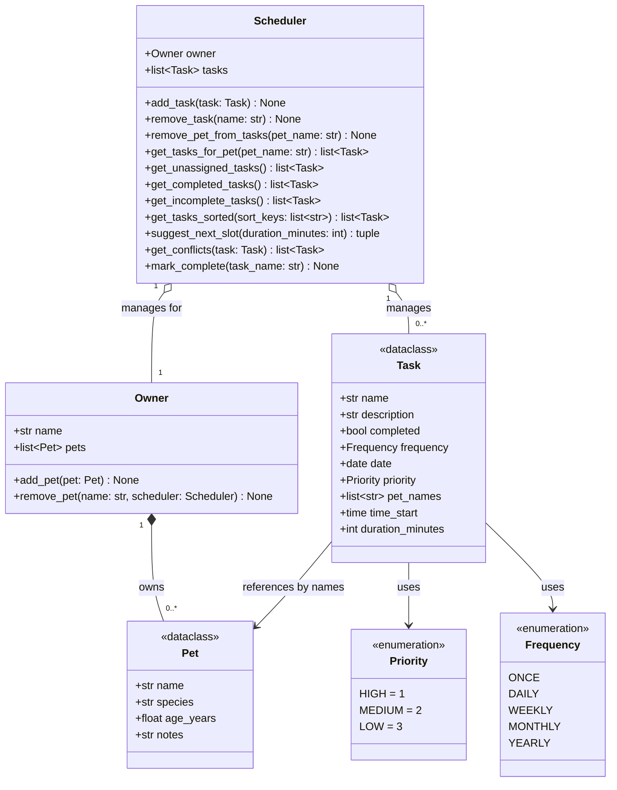

# PawPal+ UML Class Diagram

```mermaid
classDiagram

    class Priority {
        <<enumeration>>
        HIGH = 1
        MEDIUM = 2
        LOW = 3
    }

    class Frequency {
        <<enumeration>>
        ONCE
        DAILY
        WEEKLY
        MONTHLY
        YEARLY
    }

    class Task {
        <<dataclass>>
        +str name
        +str description
        +bool completed
        +Frequency frequency
        +date date
        +Priority priority
        +list~str~ pet_names
        +time time_start
        +int duration_minutes
    }

    class Pet {
        <<dataclass>>
        +str name
        +str species
        +float age_years
        +str notes
    }

    class Owner {
        +str name
        +list~Pet~ pets
        +add_pet(pet: Pet) None
        +remove_pet(name: str, scheduler: Scheduler) None
    }

    class Scheduler {
        +Owner owner
        +list~Task~ tasks
        +add_task(task: Task) None
        +remove_task(name: str) None
        +remove_pet_from_tasks(pet_name: str) None
        +get_tasks_for_pet(pet_name: str) list~Task~
        +get_unassigned_tasks() list~Task~
        +get_completed_tasks() list~Task~
        +get_incomplete_tasks() list~Task~
        +get_tasks_sorted(sort_keys: list~str~) list~Task~
        +suggest_next_slot(duration_minutes: int) tuple
        +get_conflicts(task: Task) list~Task~
        +mark_complete(task_name: str) None
    }

    Task --> Priority : uses
    Task --> Frequency : uses
    Owner "1" *-- "0..*" Pet : owns
    Scheduler "1" o-- "1" Owner : manages for
    Scheduler "1" o-- "0..*" Task : manages
    Task --> Pet : references by names
```
